# Nexora Schema Guide

**Audience:** a competent developer joining the team who has never used PostgreSQL row-level security.
**Status:** descriptive. Everything below was measured against a live, fully-migrated database, not inferred from code.
**Source of truth:** container `nexora-squash-a`, database `nexora_a`, PostgreSQL 16.14 — the reference database built by applying all 134 pre-baseline migrations in order. Cross-checked against `nexora-squash-b` (built from the single squashed baseline); the two agree on table count, RLS count, FORCE count and policy count.

Read sections 1–4 before you write your first migration. Sections 5–7 are the map. Section 8 is a proposal that has not been accepted yet. Section 9 is the defect register — nothing in it has been fixed.

---

## 1. The estate in one screen

| | public | platform | total |
|---|---:|---:|---:|
| Base tables | 226 | 41 | **267** |
| Views / materialised views | 0 | 0 | 0 |
| RLS enabled | 221 | 11 | **232** |
| RLS **forced** | 100 | 10 | **110** |
| RLS policies | 221 | 11 | **232** |
| Tables with a tenant column | 206 | 0 | **206** |

Other totals across both schemas: **548** foreign keys (0 of them cross-schema), **411** routines of which **36** are `SECURITY DEFINER`, **300** user triggers, **0** sequences-in-another-schema oddities. Every tenant discriminator column, in all five spellings, is `bigint`.

The application never connects as a superuser. It connects on a login role and then, per command, switches into one of three `NOLOGIN` group roles.

---

## 2. Tenant isolation, in plain language

### 2.1 What row-level security actually is

Normally a `GRANT SELECT ON "Leads"` means "you can read every row of `Leads`". Row-level security (RLS) changes that: once a table has RLS enabled, PostgreSQL silently appends a `WHERE <policy>` to every query against it, and checks a `WITH CHECK <policy>` on every row you try to write. Rows that fail are not an error — they simply are not there. A `SELECT count(*)` returns a different number for different users, and neither user can tell.

That last property is the reason this document exists. **An RLS policy that names the wrong column does not fail. It matches nothing, or it matches everything, and the only symptom is wrong data.**

Nexora's policy is the same shape on 220 of the 232 tables:

```sql
CREATE POLICY nexora_tenant_isolation ON public."Leads" TO nexora_tenant_app
  USING      ("BusinessUnitID" = NULLIF(current_setting('nexora.business_unit_id', true), '')::bigint)
  WITH CHECK ("BusinessUnitID" = NULLIF(current_setting('nexora.business_unit_id', true), '')::bigint);
```

`current_setting('nexora.business_unit_id', true)` reads a **session variable** (a GUC). The `true` means "return NULL instead of erroring if it was never set". So:

- GUC set to `7` → you see business unit 7's rows and can only write rows stamped 7.
- GUC **not set** → the expression is `column = NULL`, which is `NULL`, which is not `TRUE`. **Zero rows visible, every insert rejected.** This is the fail-closed default and it is deliberate.

### 2.2 Who sets the GUC

`Backend/ERP_RFQ_Automation/MultiTenancy/TenantRlsCommandInterceptor.cs` intercepts every EF Core command. Before the command runs it opens (or joins) a transaction and issues:

```sql
SET LOCAL ROLE <role>;
SELECT set_config('nexora.business_unit_id', @tenant_id, true), set_config('nexora.actor_id', …), …;
```

`SET LOCAL` and `set_config(..., true)` are both **transaction-scoped**. That matters: the app runs behind a transaction-pooled connection, and a session-scoped `SET` would leak one tenant's scope onto the next request that reuses the connection. Everything here is transaction-local by construction.

The interceptor also sets `nexora.actor_id`, `nexora.actor_signature`, and four `nexora.gl_*` values. Those are consumed by the general-ledger guard triggers, not by RLS.

### 2.3 The four roles

| Role | `BYPASSRLS` | `LOGIN` | Table grants | What it is for |
|---|---|---|---|---|
| `nexora_tenant_app` | **no** | no | 221 `public` tables (SELECT/INSERT/UPDATE/DELETE) + INSERT on `platform."PlatformAuditLogs"` | Every ordinary request. The only role RLS actually constrains. |
| `nexora_identity_app` | yes | no | `public."LoginAttempts"` (full), `public."Users"`, `public."BusinessUnits"`, `public."Setup_Master"` (SELECT), `platform."TenantAdminInvitations"` (SELECT/UPDATE) | Pre-tenant identity work: `/api/Auth/Login`, `/api/tenant-activation`. These run before a tenant is known, so they cannot be RLS-scoped. |
| `nexora_pipeline_app` | yes | no | 198 `public` + 41 `platform` tables | Platform/back-office work under `/api/platform`, and background sweeps that legitimately cross tenants. |
| table owner (`postgres` here) | superuser | yes | owns all 267 tables | Migrations only. |

All three app roles are `NOLOGIN` group roles — you cannot connect as them, you can only `SET ROLE` into them.

Routing lives in `TenantRlsCommandInterceptor.ResolveDatabaseRole`. Read the comment block above it before changing anything there; the ordering of its branches encodes two previously-live defects (a tenant JWT attached to a login request used to downgrade the role out of the privileges `LoginAttempts` needs, silently disabling the login throttle).

### 2.4 Why `FORCE` matters

RLS has a hole by default: **the table owner is exempt from its own policies.** `ENABLE ROW LEVEL SECURITY` binds everyone *except* the owner. `FORCE ROW LEVEL SECURITY` binds the owner too.

This is not theoretical here. `ResolveDirectMigrationConnection` in `Program.cs` reuses the runtime username for migrations, so in some deployments the runtime login role is also the role that owns the tables. On an `ENABLE`-only table that role sees every tenant's rows. The mitigation in place is that ordinary requests always `SET LOCAL ROLE nexora_tenant_app`, which is not the owner — but **110 of 232 tables carry `FORCE` and 122 do not**, and the ones that do not are protected by that role switch alone. See defect D4.

### 2.5 The three layers, honestly

1. **Database RLS** — fail-closed. No GUC, no rows.
2. **EF Core global query filters** — 219 `HasQueryFilter` declarations, written as `x => CurrentTenantId == null || x.BusinessUnitId == CurrentTenantId`. Note the `|| CurrentTenantId == null`: **this filter is fail-OPEN.** With no tenant it disables itself.
3. **Application authorization** — claims/middleware (`TenantClaimGuardMiddleware`, `TenantStatusGuardMiddleware`).

Layer 2 is a query optimisation and a convenience, not a security boundary. When people say "we have defence in depth on tenancy", the depth is layers 1 and 3. Layer 1 is the only one that holds when the tenant is unknown.

### 2.6 The 26 tables with no tenant column

Not every RLS table has a `BusinessUnitId`. 26 do not — 15 in `public`, 11 in `platform` — and they are isolated four different ways:

- **By a parent join — 13 tables.** `LeadItems`, `RFQItems`, `QuoteItems`, `OrderItems`, `ShipmentItems` reach their parent's tenant column via `EXISTS (SELECT 1 FROM public."Leads" parent WHERE parent."ID" = "LeadItems"."LeadID" AND parent."BusinessUnitID" = …)`. Same idea for `EmailIngests` (via `Email_Configurations`), `ProductAttachments` and `SupplierPurchaseHistory` (via `Products`/`Suppliers`), `ShipmentStatusHistory` (via `Shipments`), and the four `custom_field_*` child tables (via `custom_field_versions` → `custom_field_definitions`, the only two-hop join in any policy here).
- **By identity — 1 table.** `BusinessUnits` uses `USING ("ID" = <guc>)` — the tenant *is* the row.
- **By string literal — 1 table.** `Attachments` uses `USING ("ParentType" = 'Lead' AND EXISTS (… "Leads" …))`. Any attachment row whose `ParentType` is not exactly `'Lead'` is invisible to every tenant. See defect D10.
- **Not tenant-scoped at all — 11 `platform` tables.** Ten of them — `UsageEvents`, `UsageEventRatings`, `UsageMinuteAggregates`, `UsageCoverageSegments`, `AccountingOutbox`, `SubscriptionRevenueActions`, `SubscriptionTaxRules`, `TenantMeterSourcePolicies`, `TenantDataRecoveryEvidence`, `TenantDeletionCertificates` — carry `*_platform_fleet` policies with `USING (true) WITH CHECK (true)` granted `TO nexora_pipeline_app`. These exist to make the table unreachable by anything *except* the pipeline role, not to filter it. The eleventh, `PlatformAuditLogs`, carries `nexora_ai_policy_audit_insert`: an INSERT-only policy for `nexora_tenant_app` whose `WITH CHECK` calls the `SECURITY DEFINER` function `nexora_ai_policy_audit_allowed`, which verifies the audit row's tenant matches the caller's GUC by joining `platform."Tenants"."PrimaryBusinessUnitId"`.

### 2.7 Two things that are not policies

- **`platform` is not RLS-protected as a whole.** 30 of its 41 tables have no RLS at all — `Tenants`, `PlatformUsers`, `SubscriptionInvoices`, `SupportTickets`, and so on. That is fine, because `nexora_tenant_app` has no grant on them; its only reach into `platform` is `INSERT` on `PlatformAuditLogs`, gated by a `SECURITY DEFINER` function (`nexora_ai_policy_audit_allowed`) that checks the row's tenant matches the caller's GUC.
- **Trigger guards do the work RLS cannot.** 31 of the 411 routines are tenant-integrity guards — `nexora_validate_inventory_tenant`, `nexora_otc_validate_award`, `nexora_gl_validate_posting`, `nexora_protect_commercial_identity`, and 27 more. They enforce invariants like "a journal line's account belongs to the same tenant as the entry", which a single-table RLS predicate cannot express.

---

## 3. The two schemas

| Schema | Contains | Rule of thumb |
|---|---|---|
| `platform` | The **control plane**: who the tenants are, what plan they are on, metered usage, subscription billing, support tickets, platform staff and their MFA, tenant provisioning and offboarding. 41 tables, all `PascalCase`, keyed on `TenantId`. | Operated by Nexora, about customers. Never contains customer business data. |
| `public` | The **data plane**: everything a tenant's own users create and read. 226 tables, keyed on the business-unit discriminator. | Operated by customers, about their business. |

There are **zero foreign keys between the two schemas**. The link is `platform."Tenants"."PrimaryBusinessUnitId"` → `public."BusinessUnits"."ID"`, and it is an unenforced convention — a nullable `bigint` with no constraint behind it. It is nevertheless load-bearing: the `SECURITY DEFINER` function that authorises tenant writes into `platform."PlatformAuditLogs"` joins on it. See defect D3.

---

## 4. The five spellings

The tenant discriminator is spelled five ways. It is not five arbitrary choices; it is **three build eras**, and the spelling, the primary key style, the table naming and the foreign-key design all move together. Learn the three strata and the rest is predictable.

| Stratum | Tenant column | PK style | Table names | Column names | Tables |
|---|---|---|---|---|---:|
| **A — SQL Server legacy** | `BusinessUnitID`, `BUID`, `Buid` | `ID` | `PascalCase`, plus `Setup_Master`, `Email_Configurations`, `setUOM` | `PascalCase`, plus `Users."Password_Hash"` | 28 |
| **B — current majority** | `BusinessUnitId` | `Id` | `PascalCase` **or** `snake_case` | always `PascalCase` | 167 |
| **C — evidence pipeline** | `business_unit_id` | `id` | `snake_case` | `snake_case` | 11 |

Stratum A is provably a SQL Server import: **38 constraints still carry SQL-Server-generated names** such as `FK__Customers__BUID__0D7A0286` and `FK__Leads__BusinessU__55009F39`.

Stratum B is the confusing one for newcomers, because a `snake_case` table there has `PascalCase` columns: `supplier_purchase_orders."BusinessUnitId"`, `procurement_handoffs."BusinessUnitId"`. **77 tables are named in snake_case but have 100% PascalCase columns.** Only the 11 stratum-C tables are snake all the way down.

### Exact membership

**`BusinessUnitID` — 20 tables**
`CommercialCases`, `Contacts`, `Currency`, `Email_Configurations`, `LeadReferenceConfigurations`, `LeadStatusHistories`, `Leads`, `Orders`, `ProductCategories`, `ProductSubCategories`, `Quotes`, `RFQ`, `RolePermissions`, `Setup_Master`, `Shipments`, `Taxes`, `Teams`, `UserGroups`, `Warehouses`, `setUOM`

**`BUID` — 7 tables**
`Customers`, `Products`, `SetCity`, `SetCountry`, `SetState`, `Suppliers`, `Users`

**`Buid` — 1 table**
`Inventory`

**`business_unit_id` — 11 tables**
`canonical_inquiries`, `canonical_line_items`, `commercial_document_classifications`, `document_corpora`, `document_pages`, `document_regions`, `extraction_runs`, `field_evidence`, `source_document_occurrences`, `source_documents`, `validation_findings`

**`BusinessUnitId` — 167 tables** (everything else that is tenant-scoped)

**No tenant column — 61 tables** (41 `platform` + 20 `public`; see §2.6 for the 20)

### What the drift actually costs you

Foreign keys have to bridge the spellings, and they do — correctly, but unreadably:

```sql
-- Contacts (stratum A, "BusinessUnitID") → Suppliers (stratum A, "BUID")
FOREIGN KEY ("SupplierID", "BusinessUnitID") REFERENCES "Suppliers"("ID", "BUID")

-- supplier_purchase_orders (stratum B, "BusinessUnitId") → Suppliers (stratum A, "BUID")
FOREIGN KEY ("SupplierId", "BusinessUnitId") REFERENCES "Suppliers"("ID", "BUID")

-- canonical_inquiries (stratum C, business_unit_id) → Leads (stratum A, "BusinessUnitID")
FOREIGN KEY (business_unit_id, lead_id) REFERENCES "Leads"("BusinessUnitID", "ID")
```

The practical consequence: **you cannot audit tenant safety with a name match.** A grep for `BusinessUnitId` in a foreign-key definition tells you nothing about whether the constraint is tenant-safe, because the parent column may be spelled differently. Every tool that touches the tenant column — the RLS sweep, any parity check, any future lint — has to carry the five-name list.

---

## 5. Domain map

267 tables in 13 domains. Every table is in exactly one domain; the counts sum to 267.

| # | Domain | Tables | RLS | FORCE | Spellings present |
|---|---|---:|---:|---:|---|
| 1 | Platform control plane | 41 | 11 | 10 | — (`TenantId`) |
| 2 | Tenant, identity & access | 13 | 11 | 1 | `BusinessUnitID` ×5, `BusinessUnitId` ×4, `BUID` ×1 |
| 3 | Master data & reference | 23 | 22 | 4 | `BusinessUnitID` ×7, `BUID` ×6, `BusinessUnitId` ×6 |
| 4 | Evidence, ingestion & extraction | 20 | 20 | 5 | `business_unit_id` ×11, `BusinessUnitId` ×8 |
| 5 | Lead & RFQ intake | 23 | 23 | 9 | `BusinessUnitId` ×16, `BusinessUnitID` ×5 |
| 6 | Quoting & BOQ | 13 | 13 | 4 | `BusinessUnitId` ×11, `BusinessUnitID` ×1 |
| 7 | Supplier sourcing & procurement | 20 | 20 | 3 | `BusinessUnitId` ×20 |
| 8 | Inventory, logistics & traceability | 18 | 18 | 11 | `BusinessUnitId` ×14, `BusinessUnitID` ×1, `Buid` ×1 |
| 9 | Order to cash & receivables | 33 | 32 | 24 | `BusinessUnitId` ×30, `BusinessUnitID` ×1 |
| 10 | General ledger, banking & FX | 19 | 19 | 16 | `BusinessUnitId` ×19 |
| 11 | AI & agent governance | 11 | 11 | 5 | `BusinessUnitId` ×11 |
| 12 | Sales performance & commercial intelligence | 14 | 14 | 11 | `BusinessUnitId` ×14 |
| 13 | Governance, audit, SLA & configurability | 19 | 18 | 7 | `BusinessUnitId` ×14 |

Read that table one more time with §4 in hand. **The spelling drift is concentrated in domains 2, 3 and 5** — tenant/identity, master data, and lead/RFQ intake. Those are the oldest parts of the product and they sit directly under everything else: domains 7, 8, 9 and 10 all point *into* domain 3.

The 30 busiest cross-domain FK relationships, by count:

| From | To | FKs |
|---|---|---:|
| Order to cash & receivables | Master data & reference | 30 |
| Lead & RFQ intake | Tenant, identity & access | 22 |
| Supplier sourcing & procurement | Master data & reference | 18 |
| Master data & reference | Tenant, identity & access | 17 |
| Lead & RFQ intake | Master data & reference | 17 |
| Supplier sourcing & procurement | Lead & RFQ intake | 16 |
| Inventory, logistics & traceability | Master data & reference | 14 |
| General ledger, banking & FX | Master data & reference | 10 |

---

### 5.1 Platform control plane — 41 tables, schema `platform`

Nexora's own book of business. Keyed on `TenantId`, not on a business unit. 30 of the 41 have no RLS because no tenant role can reach them; the 11 that do carry `*_platform_fleet` policies restricting them to `nexora_pipeline_app`.

Also here: `Plans`, `RateCards`/`RateCardLines`, `ProvisioningDrafts`/`ProvisioningExecutions`/`ProvisioningSteps`, `PlatformMfa*` (5 tables), `PlatformSessions`, `PlatformBrowserTrusts`, `PlatformEmailSettings`, `ImpersonationSessions`, `SupportTicketNotes`/`SupportTicketLinks`, `TenantLifecycleEvents`, `TenantLegalHolds`, `TenantOffboardings`, `TenantExportReceipts`, `TenantAdminInvitations`, `TenantDeletionCertificates`, `BillingStatements`/`BillingStatementLines`, `SubscriptionCreditNotes`, `SubscriptionPayments`, `UsageMinuteAggregates`, `UsageCoverageSegments`.

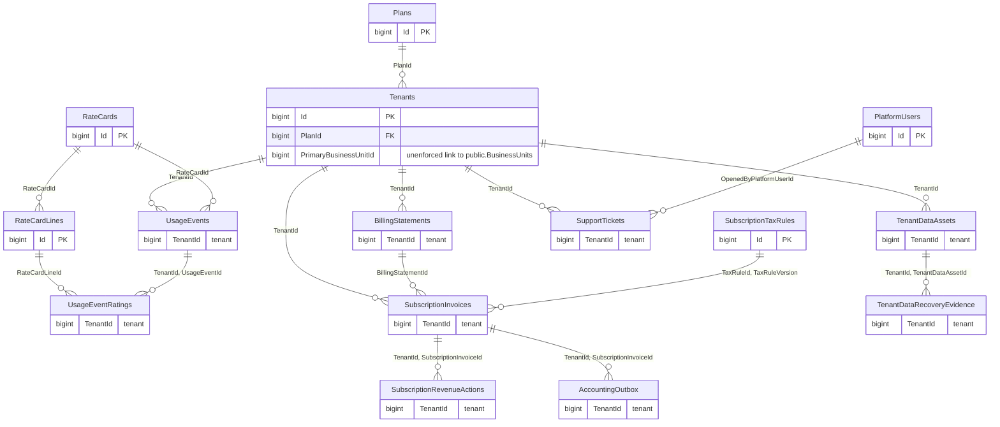

---

### 5.2 Tenant, identity & access — 13 tables

The root of the data plane. **`BusinessUnits` is the tenant table**: every other tenant column is a foreign key to `BusinessUnits."ID"`, and its own policy is `USING ("ID" = <guc>)`.

`Setup_Master` is a generic lookup table (statuses, roles, reason codes, payment methods) that a large part of stratum A points at — `Orders` alone has three FKs into it. `Module` is the one global reference table with no tenant column and no RLS, readable by `nexora_tenant_app`.

Also here: `IamAuditEvents`, `TenantQueueStates`, `QuoteConfiguration`, `LoginAttempts`, `UserColumnPreferences`.

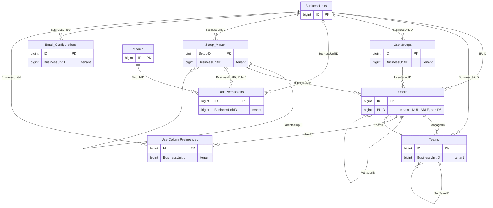

---

### 5.3 Master data & reference — 23 tables

`Customers`, `Suppliers`, `Products` and the geography/UOM/currency lookups. **This is the densest concentration of spelling drift in the estate** — 7 tables on `BusinessUnitID`, 6 on `BUID`, 6 on `BusinessUnitId` — and it is also the domain everything else points into (30 FKs from order-to-cash alone).

Note `ProductAttachments."InventoryID"` is a foreign key to `Products."ID"` despite its name — a legacy misnomer that its RLS policy has to follow.

Also here: `Attachments`, `Images`, `MasterDataChangeEvents`/`MasterDataFieldChanges`, `SupplierPurchaseHistory`, `customer_identifiers`, `customer_ownerships`, `product_supersessions`, `Taxes`.

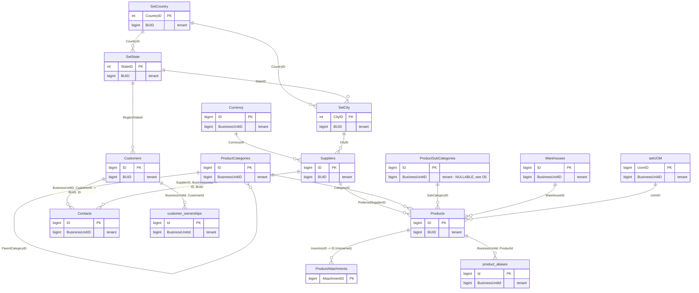

---

### 5.4 Evidence, ingestion & extraction — 20 tables

Where a customer's inbound document becomes structured data. This is stratum C and the only fully-snake_case region of the schema: `source_documents` → `document_pages` → `document_regions`, with `extraction_runs` producing `canonical_inquiries` / `canonical_line_items` and every extracted value backed by a `field_evidence` row pointing at the pixel region it came from.

The 8 `BusinessUnitId` tables here (`ExtractionJobs`, `LeadIngestion*`, `LeadOccurrenceDocuments`, `ExtractionCorpusEntries`, `extraction_dead_letter_events`, `evidence_retention_policies`, `FolderIngestionRetryStates`) are the stratum-B bridge into it — `ExtractionJobs` in particular is referenced by both conventions.

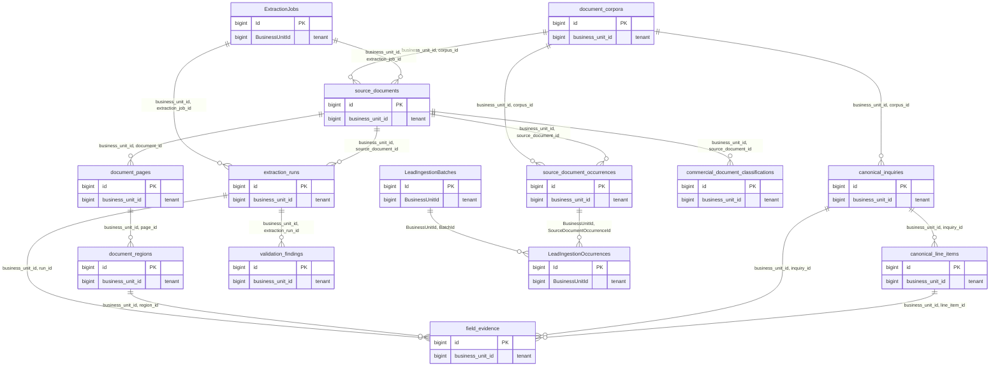

---

### 5.5 Lead & RFQ intake — 23 tables

The front of the commercial spine. `CommercialCases` is the case identity that survives the whole journey — `Leads`, `RFQ`, `Quotes`, `Orders`, `CustomerPurchaseOrders`, `ReceivableDocuments` and `supplier_purchase_orders` all carry a `CommercialCaseId`.

`Leads` is versioned: `LeadRevisions` / `LeadItemRevisions` hold the revision chain and `Leads."CurrentRevisionId"` points at the head. Routing (`lead_routing_decisions` → `lead_assignments` → `commercial_activities`) and the human queue (`unassigned_work_items`, `follow_up_tasks`) hang off it.

Also here: `LeadRevisionDifferences`, `LeadRevisionImpacts`, `LeadMatchCandidates`, `lead_customer_match_candidates`, `LeadReviewAudits`, `LeadIdentityAuditEvents`, `LeadReferenceConfigurations`, `LeadStatusHistories`, `follow_up_transition_events`, `commercial_lifecycle_events`.

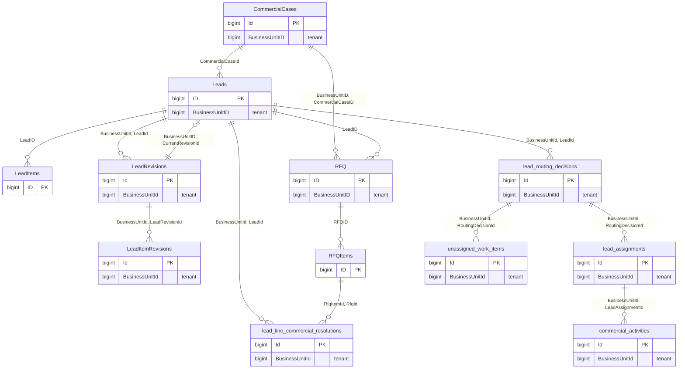

---

### 5.6 Quoting & BOQ — 13 tables

Customer-facing quoting plus the bill-of-quantities structure. `QuotePriceAttestations` / `QuotePriceAttestationLines` record that a price was signed off before it left the building; `QuoteValidityExtensions` and `QuoteRemovalRecords` are the audit trail for changing a quote after issue.

`customer_quote_sourcing_decisions` is the join between a quote line and the supplier quote that priced it — it carries 8 foreign keys and is the single densest link between this domain and procurement.

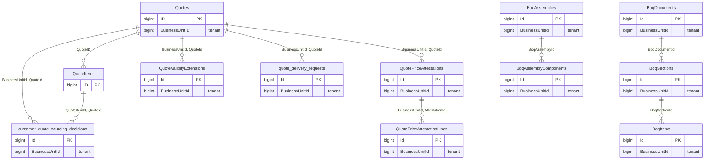

Cross-domain: `Quotes` ← `RFQ` (`RFQID`), `Quotes` → `Customers` (`CustomerID`), `QuoteItems` → `Products` / `RFQItems`, and `customer_quote_sourcing_decisions` → `supplier_quotes` / `supplier_quote_lines` / `SourcingAwards` / `SupplierQuotedItems` / `sourcing_cases`.

---

### 5.7 Supplier sourcing & procurement — 20 tables

**Entirely stratum B: all 20 tables use `BusinessUnitId`.** This is what the current convention looks like when nothing legacy is in the way.

`commercial_demand_lines` is the pivot — the normalised "we need N of this" derived from an RFQ line, which sourcing, solicitation, supplier quoting and the purchase order all key off. `procurement_handoffs` carries 10 foreign keys and is the widest join in the estate.

Also here: `supplier_quote_field_evidence`, `supplier_quote_review_decisions`, `supplier_negotiation_decisions`, `procurement_events`, `procurement_outbox`, `procurement_callback_receipts`.

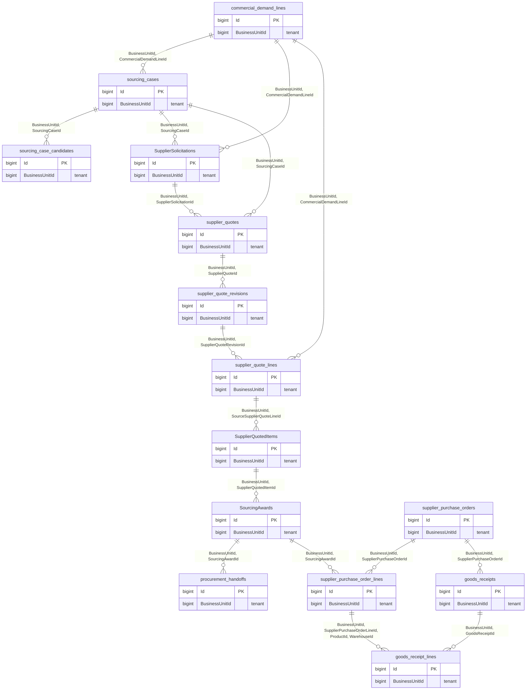

---

### 5.8 Inventory, logistics & traceability — 18 tables

Stock, lots, and proof of delivery. `Inventory` is the one table using `Buid` — a spelling that exists exactly once in the estate — and it is the parent of six stratum-B children that all spell it `BusinessUnitId`.

`material_lots` → `material_lot_certificates` / `material_lot_consumptions` is the mill-certificate traceability chain; `delivery_proofs` → `delivery_proof_lines` → `delivery_shortfall_decisions` is the receipt-and-shortfall chain.

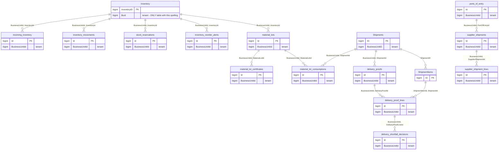

---

### 5.9 Order to cash & receivables — 33 tables

The largest domain, and the one with the strongest tenant discipline: 24 of 33 tables carry `FORCE`, and almost every foreign key inside it is tenant-composite. Two stratum-A tables sit at its head (`Orders` on `BusinessUnitID`, and `OrderItems` with no tenant column at all).

Flow: `CustomerPurchaseOrders` → `CustomerAwards` → `Orders` → `ReceivableDocuments` → `CustomerPayments`/`PaymentAllocations`, with the dunning ladder (`DunningPolicies` → `DunningRuns` → `DunningRunDecisions` → `DunningCases` → `DunningNotices` → `DunningDeliveryAttempts`) hanging off statements.

Also here: `ReceivableWriteOffs`/`WriteOffAllocations`, `CustomerRefunds`, `PromisesToPay`, `CollectionControls`, `CustomerCollectionProfiles`, `FinanceCommunicationContacts`, `FinanceOutboxMessages`, `FinanceProviderSecrets`, `CommercialFinanceAudits`, `CommercialMatchingPolicies`, `LegalDocumentCounters`, `OrderToCashAuditEvents`, `OrderToCashDocumentCounters`.

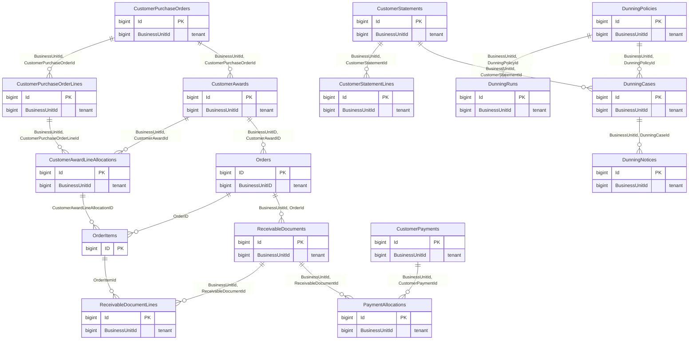

---

### 5.10 General ledger, banking & FX — 19 tables

All 19 on `BusinessUnitId`; 16 of 19 forced. This is the most tightly-controlled region of the schema: on top of RLS it carries a set of `nexora_gl_*` guard triggers that verify a signed actor envelope (`nexora.actor_id`, `nexora.gl_signature`, `nexora.gl_nonce`, `nexora.gl_expires_at`) on every posting.

`LedgerActorNonces` is the replay-protection table for that envelope. It is the only tenant-scoped table in the estate with **RLS enabled and zero policies** — deny-all. That is deliberate: it is written by `nexora_gl_authenticated_actor`, a `SECURITY DEFINER` function owned by `postgres`, and it is not granted to `nexora_tenant_app` at all. See D7 for why it is still worth a comment.

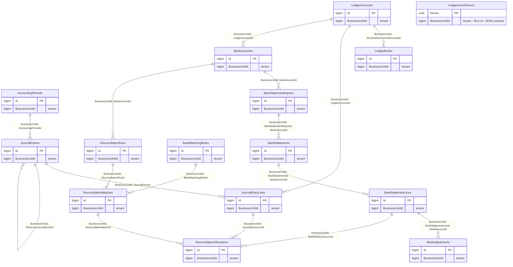

`FxRates` and `FxRateSnapshots` also live here and are the only two GL-domain tables without `FORCE`.

---

### 5.11 AI & agent governance — 11 tables

Per-tenant AI policy, spend metering, and the agent conversation log. `AiProcessingPolicies` is unusual: its **primary key is `BusinessUnitId`** — exactly one policy row per tenant. It is also the only table in the estate carrying two policies (see D1).

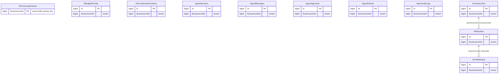

`AgentSessions`, `AgentMessages`, `AgentApprovals`, `AgentPolicies`, `AgentAuditLogs` and `learning_governance_events` have no intra-domain foreign keys — they are correlated by identifier columns rather than declared relationships.

---

### 5.12 Sales performance & commercial intelligence — 14 tables

Two parallel recommend/act/measure loops, both built on the same shape: a `*_recommendations` or `*_cases` head, an `*_events` log, an `*_outbox` for delivery, and `*_operations` for idempotency. All stratum B, 11 of 14 forced.

```mermaid
erDiagram
    commercial_opportunity_recommendations {
        bigint Id PK
        bigint BusinessUnitId "tenant"
    }
    commercial_opportunity_events {
        bigint Id PK
        bigint BusinessUnitId "tenant"
    }
    commercial_opportunity_outbox {
        bigint Id PK
        bigint BusinessUnitId "tenant"
    }
    commercial_opportunity_feedback {
        bigint Id PK
        bigint BusinessUnitId "tenant"
    }
    commercial_opportunity_outcomes {
        bigint Id PK
        bigint BusinessUnitId "tenant"
    }
    commercial_opportunity_operations {
        bigint Id PK
        bigint BusinessUnitId "tenant"
    }
    commercial_exception_cases {
        bigint Id PK
        bigint BusinessUnitId "tenant"
    }
    commercial_exception_events {
        bigint Id PK
        bigint BusinessUnitId "tenant"
    }
    commercial_exception_outbox {
        bigint Id PK
        bigint BusinessUnitId "tenant"
    }
    commercial_exception_operations {
        bigint Id PK
        bigint BusinessUnitId "tenant"
    }
    sales_rep_profiles {
        bigint Id PK
        bigint BusinessUnitId "tenant"
    }
    sales_team_memberships {
        bigint Id PK
        bigint BusinessUnitId "tenant"
    }
    sales_contributions {
        bigint Id PK
        bigint BusinessUnitId "tenant"
    }

    commercial_opportunity_recommendations ||--o{ commercial_opportunity_events    : "BusinessUnitId, OpportunityRecommendationId"
    commercial_opportunity_recommendations ||--o{ commercial_opportunity_feedback  : "BusinessUnitId, OpportunityRecommendationId"
    commercial_opportunity_recommendations ||--o{ commercial_opportunity_outcomes  : "BusinessUnitId, OpportunityRecommendationId"
    commercial_opportunity_recommendations ||--o{ commercial_opportunity_operations : "BusinessUnitId, OpportunityRecommendationId"
    commercial_opportunity_recommendations ||--o{ commercial_opportunity_recommendations : "BusinessUnitId, SupersedesRecommendationId"
    commercial_opportunity_events ||--o{ commercial_opportunity_outbox : "BusinessUnitId, OpportunityEventId"
    commercial_exception_cases  ||--o{ commercial_exception_events     : "BusinessUnitId, CommercialExceptionCaseId"
    commercial_exception_cases  ||--o{ commercial_exception_operations : "BusinessUnitId, CommercialExceptionCaseId"
    commercial_exception_events ||--o{ commercial_exception_outbox     : "BusinessUnitId, CommercialExceptionEventId"
```

`sales_coaching_acknowledgements` is also in this domain; it links to `Users` rather than to anything here.

---

### 5.13 Governance, audit, SLA & configurability — 19 tables

Cross-cutting machinery. Two things live here that a newcomer should know about:

**Governed artifacts** — `governed_artifacts` / `governed_artifact_versions` / `governed_artifact_events` plus `human_action_items` / `human_action_events` are the approval-and-evidence substrate that other domains write into.

**Custom fields** — the configurability engine, and the one place where the tenant column is deliberately absent from four child tables. `custom_field_definitions` and `custom_field_records`/`custom_field_values` carry `BusinessUnitId`; `custom_field_versions`, `custom_field_options`, `custom_field_rules` and `custom_field_dependencies` do not, and reach the tenant through a two-hop `EXISTS` back to `custom_field_definitions`. This is the only two-level join in any policy in the estate.

Also here: `SlaPolicies`/`SlaEvents`, `MetricEvents`, `ReportSubscriptions`, `lifecycle_outbox_messages`, `tenant_governance_audit_events`, and `__EFMigrationsHistory` (no RLS; all privileges explicitly revoked from `nexora_tenant_app`).

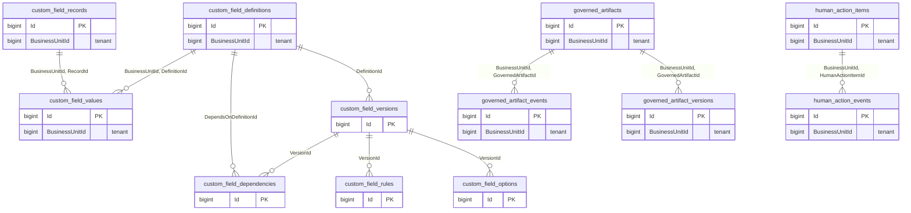

---

## 6. Adding a new table

Follow this and your table will be indistinguishable from stratum B, which is where the estate is converging.

**Naming**

1. Table name `snake_case`, plural: `supplier_shipment_lines`. (Existing `PascalCase` tables stay as they are — see §8.)
2. Column names `PascalCase`: `BusinessUnitId`, `CreatedOn`, `SupplierShipmentId`.
3. Primary key `Id`, `bigint`, identity.
4. Tenant column **exactly** `BusinessUnitId`, `bigint`, **`NOT NULL`**. Never nullable — a NULL tenant makes the row invisible to every tenant role (`NULL = 7` is `NULL`, not `TRUE`).
5. Foreign key constraint names `FK_<child>_<parent>_<columns>`; indexes `IX_<table>_<columns>`; unique `UX_`/`UQ_`; checks `CK_<table>_<meaning>`.

**Tenancy**

6. Declare a **composite, tenant-safe** foreign key to every tenant-scoped parent: `FOREIGN KEY ("BusinessUnitId", "ParentId") REFERENCES parent ("BusinessUnitId", "Id")`. This requires the parent to have a unique index on `(BusinessUnitId, Id)` — add one if it lacks it. A single-column `ParentId` FK lets a tenant point a row it owns at a row it cannot see.
7. Add the FK to `BusinessUnits`: `FOREIGN KEY ("BusinessUnitId") REFERENCES "BusinessUnits"("ID")`.
8. Enable **and force** RLS, and declare the policy literally — do not rely on a sweep:

```sql
ALTER TABLE public.my_new_table ENABLE ROW LEVEL SECURITY;
ALTER TABLE public.my_new_table FORCE  ROW LEVEL SECURITY;

CREATE POLICY nexora_tenant_isolation ON public.my_new_table
    TO nexora_tenant_app
    USING      ("BusinessUnitId" = NULLIF(current_setting('nexora.business_unit_id', true), '')::bigint)
    WITH CHECK ("BusinessUnitId" = NULLIF(current_setting('nexora.business_unit_id', true), '')::bigint);
```

9. Grant explicitly: `GRANT SELECT, INSERT, UPDATE, DELETE ON public.my_new_table TO nexora_tenant_app;` and whatever `nexora_pipeline_app` needs. A table with RLS and no grant is unreachable; a table with a grant and no policy is unreadable. Both fail silently.
10. Index `("BusinessUnitId", …)` leading with the tenant column — every query carries the predicate, so it belongs first.

**Verification** — do not skip this

11. `Backend/ERP_RFQ_Automation.Tests/Support/schema-parity-queries.sql` dumps every non-table control (roles, grants, RLS, policies, triggers, functions, constraints, indexes, defaults) in a diffable form. Run it before and after and diff.
12. Prove isolation, do not assume it. Two tenants, one table, `SET LOCAL ROLE nexora_tenant_app`, `set_config('nexora.business_unit_id', …)`, assert row counts differ and a cross-tenant `INSERT` raises `new row violates row-level security policy`.

**Types**

13. Timestamps: **use `timestamptz`.** The estate currently has 554 `timestamp without time zone` columns against 78 `timestamptz`, which is a legacy default, not a decision (see D8). Do not add to the pile.
14. Money: `numeric(18,2)` matches existing practice. Always store the currency alongside it.

---

## 7. Where things live

| What | Where |
|---|---|
| Squashed baseline (the schema, as declarative SQL) | `Backend/ERP_RFQ_Automation/MigrationsBaseline/Sql/` — 13 files, `00_execution_roles` … `11_reference_data`, `90_down` |
| RLS enable + all 232 policies | `MigrationsBaseline/Sql/08_row_level_security.sql` (3,089 lines, **232 literal `CREATE POLICY` statements, no dynamic sweep**) |
| `FORCE ROW LEVEL SECURITY` statements | `MigrationsBaseline/Sql/03_tables_and_sequences.sql` |
| Role creation and attributes | `MigrationsBaseline/Sql/00_execution_roles.sql` |
| Grants / explicit revokes | `MigrationsBaseline/Sql/09_privileges.sql`, `10_explicit_revokes.sql` |
| The original dynamic RLS sweep (historical) | `Migrations/20260723120000_CompleteTenantRlsCoverage.cs` |
| Role selection per request | `MultiTenancy/TenantRlsCommandInterceptor.cs` (`ResolveDatabaseRole`) |
| Schema parity diff tool | `Backend/ERP_RFQ_Automation.Tests/Support/schema-parity-queries.sql` |
| EF model, split by domain | `Models/ErpRfqAutomationContext.*.cs` (30+ partials) |
| EF model snapshot | `MigrationsBaseline/ErpRfqAutomationContextModelSnapshot.cs` |
| Schema lifecycle decision (proposed) | `docs/adr/ADR-DB-01-schema-lifecycle.md` — where DDL lives and how the squash is maintained |

---

## 8. Proposal: naming standard and remediation

### 8.1 The standard (for new work)

| Object | Standard | Rationale |
|---|---|---|
| Tenant column | `BusinessUnitId` | Already 167 of 206 tenant-scoped tables (81%). Any other choice makes the majority the exception. |
| Tenant column type | `bigint NOT NULL` | Already universal for the type; `NOT NULL` closes D5. |
| Primary key | `Id bigint` identity | Already 209 of 249 single-column PKs. |
| Table name | `snake_case`, plural | The direction of travel: 88 of 226 public tables, and every table added in the last several months. |
| Column name | `PascalCase` | Matches 77 of the 88 snake_case tables and all 134 PascalCase tables. |
| Schema | `public` for tenant data, `platform` for control plane | Already clean. |
| Policy name | `nexora_tenant_isolation` | Already 220 of 232. |
| Session variable | `nexora.business_unit_id` | Already universal. |

The `snake_case` table / `PascalCase` column pairing is genuinely odd, and if this were a greenfield schema it would be all-snake. It is not greenfield. Picking all-snake for new tables would create a **fourth** stratum and make the existing 77-table majority wrong. Consistency with what exists beats theoretical purity.

### 8.2 What renaming actually costs — measured, not assumed

I tested every claim below on PostgreSQL 16.14 in a throwaway database, because the received wisdom about renaming RLS columns is partly wrong and the wrong parts matter.

| Operation on a column named in an RLS policy | Result |
|---|---|
| `ALTER TABLE … ALTER COLUMN … TYPE …` | **Fails.** `ERROR: 0A000: cannot alter type of a column used in a policy definition` |
| `ALTER TABLE … DROP COLUMN …` | **Fails.** `ERROR: 2BP01: cannot drop column … because other objects depend on it` |
| `ALTER TABLE … RENAME COLUMN …` | **Succeeds — and PostgreSQL rewrites the policy expression automatically.** |

That last row is the finding that changes the calculus. Policies are stored as parse trees, not text, so a rename carries them. Verified: after `ALTER TABLE t RENAME COLUMN "BUID" TO "BusinessUnitId"`, `pg_policies.qual` reads `("BusinessUnitId" = …)` and isolation still filters correctly.

The same is true of everything else stored as a parse tree:

| Object referencing the column | Survives a rename? |
|---|---|
| RLS policies (`USING`, `WITH CHECK`) | **Yes** — expression rewritten |
| Indexes, including partial and composite | **Yes** |
| `CHECK` and `UNIQUE` constraints | **Yes** |
| Foreign keys, both sides | **Yes** |
| Views | **Yes** — and the view's *output* column name is preserved, so `SELECT "BUID" FROM vw` keeps working |
| **`plpgsql` / `sql` function bodies** | **NO — and this is the whole problem** |

Function bodies are stored as text. A rename does not touch them and raises no error. The failure appears the first time the function is called: `ERROR: column "BUID" does not exist`. **31 of the 411 routines in this database reference a legacy spelling in their body**, and every single one of them is a tenant-integrity guard trigger:

`nexora_validate_inventory_tenant`, `nexora_validate_procurement_product_tenant`, `nexora_reject_referenced_inventory_tenant_change`, `nexora_reject_referenced_product_tenant_change`, `nexora_gl_guard_account`, `nexora_gl_guard_book`, `nexora_gl_guard_journal`, `nexora_gl_guard_line`, `nexora_gl_validate_posting`, `nexora_otc_validate_award`, `nexora_otc_validate_purchase_order`, `nexora_otc_validate_purchase_order_line`, `nexora_otc_validate_allocation`, `nexora_otc_order_source_guard`, `nexora_otc_order_item_source_guard`, `nexora_otc_outbox_event`, `nexora_ar_validate_tenant_reference`, `nexora_receivable_issued_immutable`, `nexora_receivable_order_item_valid`, `nexora_protect_commercial_identity`, `nexora_validate_downstream_commercial_identity`, `nexora_validate_lead_commercial_identity`, `nexora_validate_order_commercial_identity`, `nexora_validate_commercial_line_resolution`, `nexora_validate_opportunity_recommendation_lineage`, `nexora_validate_inventory_warehouse_tenant`, `nexora_validate_procurement_inventory_tenant`, `nexora_assign_commercial_case`, `nexora_guard_commercial_exception_case`, `nexora_record_lead_status_history`, `nexora_release01b_contact_tenant_guard`.

Read that list again. The rename would silently disarm exactly the controls that stop cross-tenant writes, and the first symptom would be corrupt data, not an error.

Outside the database, the blast radius is smaller than you would expect, because the C# model already normalised: `Models/ErpRfqAutomationContext.cs` maps the CLR property `BusinessUnitId` onto the column via `HasColumnName("BusinessUnitID")`. Only **8 non-migration `.cs` files** name a legacy spelling in a string literal, and only the 8 `Buid` entity properties (`Customer`, `Supplier`, `Product`, `Inventory`, `User`, `SetCity`, `SetState`, `SetCountry`) would need a CLR rename.

### 8.3 The options, honestly

**Option A — expand/contract with a generated column.** *Rejected.* A `GENERATED ALWAYS AS ("BusinessUnitId") STORED` alias is readable but **not writable**: `ERROR: cannot insert a non-DEFAULT value into column "BUID"`. Verified. It cannot serve as a compatibility write path, which is the only thing an expand/contract shim needs to do.

**Option B — `security_invoker` compatibility views.** *Works, but buys nothing here.* Verified: a `CREATE VIEW … WITH (security_invoker = true)` aliasing `"BusinessUnitId" AS "BUID"` is both selectable and insertable by `nexora_tenant_app`, and correctly enforces the base table's RLS. But the callers that need the old name are trigger function bodies and EF mappings, neither of which can be pointed at a view without the same amount of editing as fixing them directly. It adds 28 objects and solves nothing.

**Option C — rename in one transaction, fix the functions in the same transaction.** Technically sound. `ALTER TABLE … RENAME COLUMN` is a catalogue-only operation — no table rewrite, no long lock on data, sub-second even on large tables. Wrap all 28 renames plus `CREATE OR REPLACE FUNCTION` for the 31 guards in one migration and it is atomic.

**Option D — freeze the standard, never rename.** Zero risk, permanent cognitive cost.

### 8.4 Recommendation

**Adopt Option D now, and keep Option C on the table for exactly two tables.**

The case for not renaming:

1. **The cost is real and it is concentrated in the safety controls.** 31 trigger functions, all of them tenant guards. Every one has to be rewritten by hand and re-tested against a two-tenant fixture. There is no compiler and no DDL error to catch a mistake — a missed rewrite produces a guard that throws at runtime in production, or worse, one that was rewritten wrongly and now passes everything.
2. **The benefit is smaller than it looks, because the squash already fixed the real problem.** The original complaint — "138 of 232 policies are conjured by a dynamic `information_schema` sweep, so a wrong spelling compiles and matches nothing" — is a property of `20260723120000_CompleteTenantRlsCoverage`. The squashed baseline replaced that sweep with **232 literal `CREATE POLICY` statements in `08_row_level_security.sql` and no `information_schema` loop at all.** Every policy is now visible, greppable, and reviewable in one file. The spelling is still inconsistent, but it is no longer *invisible*, and invisibility was the actual danger.
3. **The application layer is already uniform.** Developers write `entity.BusinessUnitId` regardless of stratum. The five spellings are visible in migrations, raw SQL and trigger bodies — a much smaller surface than the C# they spend their day in.
4. **Renaming does not fix the defect that actually matters.** 78 tenant-to-tenant foreign keys are missing the tenant column entirely (D2). That is a real isolation gap, it lives in the same legacy stratum, and it is fixed by *adding* constraints — an additive, verifiable, individually-revertible change. Spend the migration budget there.

The two exceptions worth arguing about:

- **`Inventory."Buid"` → `"BusinessUnitId"`.** One table, one spelling used nowhere else in 267 tables. It is a pure typo of `BUID`, it is the parent of six stratum-B children that all spell it `BusinessUnitId`, and it accounts for 4 of the 31 affected functions. Cheapest possible reduction: five spellings become four.
- **`ProductSubCategories."BusinessUnitID"` → `NOT NULL`.** Not a rename at all — a nullability fix (D5). `ALTER COLUMN … SET NOT NULL` is permitted on a policy column; only `TYPE` and `DROP` are blocked.

**What to do instead of renaming, in order:**

1. **Freeze the standard.** §8.1 goes in the PR template. New tables use `BusinessUnitId`. No exceptions.
2. **Add a CI guard**, not a rename. A test that fails the build if a new table appears with a tenant column not spelled `BusinessUnitId`, or with RLS enabled and no policy, or with a policy naming a column that does not exist on the table. All three are single queries against `information_schema` / `pg_policies` and all three catch the failure mode the original migration comment warned about.
3. **Put the five-name list in exactly one place.** Today it is duplicated across migrations, the parity SQL and any ad-hoc audit. One `nexora_tenant_column(regclass) RETURNS text` helper function that every tool calls turns "five spellings" from a hazard into a lookup.
4. **Comment the drift where it lives.** `COMMENT ON COLUMN public."Customers"."BUID" IS 'Tenant discriminator. Legacy spelling; standard is BusinessUnitId. See docs/database/SCHEMA-GUIDE.md §4.'` on all 28 stratum-A tenant columns. Free, zero risk, and it shows up in every tool a developer uses.
5. **Then** spend the migration budget on the defects that change behaviour: D4 (`FORCE` on the remaining 122 tables — one migration, no behaviour change, largest risk reduction per line), D1, D5, D6 and D2.

If the team later decides it wants the rename anyway, the sequencing is: fix D2 first (composite FKs make the guards partly redundant), then rename `Inventory."Buid"` alone as a pilot and measure what broke, then decide about the remaining 27.

---

## 9. Defect register

Ranked by expected harm, with D11–D13 appended from a separate model-versus-database verification pass. **Nothing here has been fixed.** Every figure was measured against the live reference database; where a number differs from an earlier audit, the earlier number is called out and corrected rather than quietly replaced.

Cheapest-first, if you want an order to work in: **D4** (one migration, `FORCE` on 122 tables, no behaviour change) → **D5** and **D6** (three small ALTERs and four policy rewrites) → **D1** (delete or re-scope one policy) → **D13** (six indexes) → **D2** (78 constraints, the real work) → **D3**, **D8**, **D12** (each needs a decision before it needs code).

### D1 — Cross-tenant INSERT permitted on `AiProcessingPolicies`
**Severity: high.** `public."AiProcessingPolicies"` carries a second, `PERMISSIVE`, `FOR INSERT` policy named `nexora_ai_default_provisioning`, granted `TO public`. Its `WITH CHECK` pins nine columns to fixed values but **does not constrain `BusinessUnitId`**. Permissive policies are OR-ed, so any role with `INSERT` — including `nexora_tenant_app` — can insert an AI-processing-policy row for *any other tenant's* business unit.

Because the table's primary key **is** `BusinessUnitId`, the practical effects are: (a) tenant A can pre-empt tenant B's provisioning row, after which B's own provisioning fails on a primary-key conflict; and (b) 18 columns are left unpinned by that `WITH CHECK` — including `RetentionDays`, `DataResidency`, `EgressPolicy`, `ExternalDependencyCeilingPercent`, `AllowedDataClassifications`, `PrivacyReviewRequired`, `RedactionRequired` — so the attacker chooses another tenant's AI governance settings within the bounds of the `CK_AiProcessingPolicies_*` check constraints.

The inserted row is conservative by shape (`ExternalProcessingAllowed = false`), so this is not a data-exfiltration path. It is a clean break of the invariant "no tenant writes another tenant's row", it is the only such break in 232 policies, and `TO public` means every role added in future inherits it.

### D2 — 78 tenant-to-tenant foreign keys omit the tenant column
**Severity: high.** Of 400 foreign keys where both child and parent are tenant-scoped, **322 are tenant-safe** (the constraint pairs the child's tenant column to the parent's) and **78 are not**. A single-column FK is validated by the system with RLS bypassed, so a tenant can create a row it owns that references a row in another tenant it cannot see — a dangling cross-tenant pointer that RLS then hides from both parties.

The 78 cluster almost perfectly on stratum A: `Orders` (8), `Quotes` (5), `RFQ` (4), `Products` (5), `Customers` (2), `Suppliers` (3), `Leads` (4), `Setup_Master`, `Currency`, `Teams`, `Users`, `SetCity`/`SetState`/`SetCountry`, plus `CollectionControls`, `CustomerPayments`, `CustomerStatements`, `DunningCases`, `ReceivableDocuments`, `BoqItems`/`BoqSections`/`BoqAssemblyComponents`, `UserColumnPreferences`, `customer_identifiers`, `ExtractionCorpusEntries`.

Partially mitigated today by the 31 guard trigger functions in §8.2 — which is why those functions must not be broken by a careless rename.

### D3 — No referential integrity between the control plane and the data plane
**Severity: medium-high.** There are **zero foreign keys between `platform` and `public`**. `platform."Tenants"."PrimaryBusinessUnitId"` is a nullable `bigint` pointing at `public."BusinessUnits"."ID"` with nothing enforcing it. It is nevertheless load-bearing: `nexora_ai_policy_audit_allowed`, the `SECURITY DEFINER` function that authorises the only tenant write into `platform`, joins on it. A `Tenants` row whose `PrimaryBusinessUnitId` is stale, null, or pointing at a deleted business unit silently fails that authorisation, or authorises the wrong thing.

Cross-schema foreign keys are legal in PostgreSQL. The absence here looks like an artifact of the two schemas having been built by different migrations rather than a decision.

### D4 — 122 of 232 RLS tables are not `FORCE`d
**Severity: medium.** `ENABLE ROW LEVEL SECURITY` exempts the table owner. 110 tables carry `FORCE`; **122 do not**, and the split is not principled — it tracks *when* the table was added. Compare: general ledger 16 of 19 forced, order-to-cash 24 of 33, but supplier sourcing 3 of 20, quoting 4 of 13, master data 4 of 23, and tenant/identity 1 of 13.

The exposure depends on deployment. `Program.cs`'s `ResolveDirectMigrationConnection` reuses the runtime username for migrations, so where the runtime login role owns the tables, a query that reaches an `ENABLE`-only table without the `SET LOCAL ROLE nexora_tenant_app` switch sees every tenant. The comment in `TenantRlsCommandInterceptor` records this being verified empirically: "a `SELECT` on an `ENABLE`-only tenant table returned EVERY tenant's rows."

`FORCE` is free, has no runtime cost, and can be applied in one migration. The 122 tables that lack it are the cheapest large risk reduction available.

### D5 — Two nullable tenant columns
**Severity: medium.** `public."Users"."BUID"` and `public."ProductSubCategories"."BusinessUnitID"` are nullable. Every other tenant column across all 206 tenant-scoped tables is `NOT NULL`.

A NULL tenant column makes the row **invisible to every tenant role** — `NULL = 7` evaluates to `NULL`, not `TRUE`, so it fails both `USING` and `WITH CHECK`. Such a row can only be reached by `nexora_pipeline_app` or `nexora_identity_app` (both `BYPASSRLS`). For `Users` this is arguably load-bearing during the pre-tenant activation flow, which runs as `nexora_identity_app`; for `ProductSubCategories` there is no such story and it looks like an oversight — the parent `ProductCategories."BusinessUnitID"` is `NOT NULL`.

The EF model agrees with the database on both (`b.Property<long?>("Buid")` for `User`, `b.Property<long>("Buid")` elsewhere), so this is a schema decision, not drift.

### D6 — Dead `IS NULL` branches in four policies
**Severity: medium (correctness of reading, not of behaviour).** The RLS sweep emitted an `%I IS NULL OR ` prefix for `Customers`, `Suppliers`, `Products` and `Inventory` when their tenant column was nullable. Those columns are now all `NOT NULL`, so the branch is unreachable — but it survives in four policies:

- `public."Products"` — `USING (("BUID" IS NULL) OR ("BUID" = …))` against `WITH CHECK ("BUID" = …)`
- `public."Inventory"` — same asymmetry on `"Buid"`
- `public."ProductAttachments"` — inherits it through `EXISTS (… "Products" … product."BUID" IS NULL OR …)`
- `public."SupplierPurchaseHistory"` — inherits it twice, through both `"Products"` and `"Suppliers"`

`Customers` and `Suppliers` no longer carry it directly, which makes the set look arbitrary. The asymmetry between `USING` and `WITH CHECK` on the same policy is the part that costs reader-time: it reads as a deliberate "readable but not writable" exemption, and it is not one.

### D7 — `LedgerActorNonces`: RLS enabled, zero policies
**Severity: low, but latent.** The only tenant-scoped table in the estate with RLS on and no policy — deny-all for any non-owner, non-bypass role. This is currently correct: it is written only by `nexora_gl_authenticated_actor` (`SECURITY DEFINER`, owned by `postgres`), and `nexora_tenant_app` has **no grant on it at all**.

But the reason it works is the *missing grant*, not the missing policy. The day someone adds `nexora_tenant_app` to the grant list — a plausible thing to do while debugging a ledger issue — the table returns zero rows and rejects every write, with no error message that points at RLS. It is one `COMMENT ON TABLE` away from being safe to inherit.

### D8 — 554 `timestamp without time zone` columns
**Severity: medium for this product specifically.** Across both schemas: 554 `timestamp without time zone` against 78 `timestamptz` (36 in `platform`, 42 in `public`) and 29 `date`. Naked `timestamp` discards the offset. For an ERP whose Phase-1 target is Saudi e-invoicing — where an invoice's issue instant is a regulated field and the clearance response carries its own timestamp — storing local-wall-clock time with no zone is a future correctness bug, not just a style issue. `platform."Tenants"` alone has `CreatedOn`, `ModifiedOn`, `BillingStartsOn`, `ContractStartOn`, `ContractEndOn`, `TrialEndsOn` and `DeploymentProfileApprovedOn` all as bare `timestamp`, alongside a `TimeZoneId` column that exists precisely because the timestamps do not carry one.

### D9 — Table and column naming is three overlapping conventions
**Severity: low individually, high in aggregate.** Covered in §4. Concretely: 134 `PascalCase` tables and 88 `snake_case` tables in `public`; 77 of the snake_case tables have 100% `PascalCase` columns while 11 are snake all the way down; `Setup_Master` and `Email_Configurations` are `Snake_Pascal`; `setUOM` is camelCase; `public."Users"."Password_Hash"` is the single snake-cased column in a PascalCase table; primary keys are `Id` (209), `ID` (29) and `id` (11); and **38 constraints still carry SQL-Server-generated names** like `FK__Customers__BUID__0D7A0286`.

None of this breaks anything. All of it costs every developer a lookup, every time.

### D10 — `Attachments` isolation depends on a string literal
**Severity: low, with a data-loss shape.** `public."Attachments"` has no tenant column. Its policy is `USING ("ParentType" = 'Lead' AND EXISTS (… "Leads" …))`. Any attachment row whose `ParentType` is not exactly `'Lead'` is invisible to every tenant and cannot be written by one. If attachments are ever extended to another parent type — quotes, RFQs, orders — the rows will be created by the pipeline role and then vanish from the product, with no error anywhere.

### D11 — EF model / database drift (the "23 constraints, 9 indexes" figure does not reproduce)
**Severity: medium.** Tonight's audit reported 23 constraints and 9 indexes declared in the EF model and missing from the database. Re-derived against `nexora_a` by parsing all 27,576 lines of `ErpRfqAutomationContextModelSnapshot.cs` and canonicalising every expression *through PostgreSQL itself* (temp table + `pg_get_constraintdef`, rolled back), the real forward deficit is **6 indexes and 12 constraints** — 9 foreign keys and 3 unique constraints, and **zero check constraints**.

| | Model declares | Live database holds |
|---|---:|---:|
| Indexes | 865 | 1,272 |
| Unique / alternate keys | 135 column-sets | 132 UNIQUE constraints |
| Check constraints | 268 | 379 |
| Foreign keys | 532 | 548 |

**Model-declared, database-missing — indexes (6, all `public`, all non-unique):**
`IX_commercial_activities_BusinessUnitId_CustomerId`, `IX_commercial_activities_BusinessUnitId_LeadAssignmentId`, `IX_follow_up_tasks_BusinessUnitId_CustomerId`, `IX_follow_up_transition_events_BusinessUnitId_FollowUpTaskId`, `IX_sales_contributions_BusinessUnitId_CustomerId`, `IX_sales_team_memberships_BusinessUnitId_TeamId`. Confirmed absent under any name.

**Model-declared, database-missing — foreign keys (9).** Every one is a *single-column* FK the model wants where the database instead carries a hand-written tenant-composite FK on the same relationship: `commercial_activities(SalesRepUserId)`, `customer_ownerships(PrimaryUserId)`, `customer_ownerships(BackupUserId)`, `follow_up_tasks(AssignedToUserId)`, `lead_assignments(ToUserId)`, `sales_contributions(SalesRepUserId)`, `sales_rep_profiles(UserId)`, `sales_team_memberships(UserId)` — all → `Users` — plus `customer_identifiers(BusinessUnitId, CustomerId)` → `Customers`. **The database is the stricter of the two here.** This is drift in the model's favour, not a missing constraint.

**Model-declared, database-missing — unique constraints (3):** `Teams(BusinessUnitID, ID)`, `follow_up_tasks(BusinessUnitId, Id)`, `lead_assignments(BusinessUnitId, Id)` exist as unique *indexes* rather than named constraints. PostgreSQL accepts a unique index as an FK target, so this is cosmetic.

**The reverse drift is larger and matters more.** The database holds 111 check constraints, 25 foreign keys, 14 indexes, 43 constraint triggers, 2 `EXCLUDE` constraints and 2 whole tables (`FinanceProviderSecrets`, `LedgerActorNonces`) that the EF model knows nothing about — concentrated in `platform` billing/usage and AI governance, where migrations used raw SQL. See D13.

Forward drift is confined to one cluster: the sales-routing/CRM tables touched by `Module03TenantSafeSalesRouting` and `V2Gate05SalesCoachingGrowthIntelligence`, where migrations wrote tenant-composite FKs in raw SQL while the model kept the single-column navigation.

Cross-checked against `nexora_b` (built from the squash baseline alone): identical counts — 1,272 indexes, 548 FKs, 379 checks. **The squash is faithful.** The drift is between the EF model and both PostgreSQL schemas, and it is structural.

### D12 — The portable test lane runs against a materially weaker schema
**Severity: medium-high, and easy to miss.** `20260811033109_SquashedSchemaBaseline.Up()` branches on provider: on PostgreSQL it replays the `Sql/*.sql` pg_dump and returns; the 863 `migrationBuilder.CreateIndex` operations only execute on the SQLite / SQL Server "portable lane". Combined with D11's reverse drift, that means the SQLite test schema is missing **111 check constraints, 25 foreign keys, 43 constraint triggers, 2 exclusion constraints, 2 tables — and row-level security entirely**, because SQLite has neither roles nor RLS.

The consequence is stated plainly in `TenantRlsCommandInterceptor`'s own comments ("no test on the SQLite suite can see it because SQLite has neither roles nor row-level security"). **An invariant proven on the portable lane is not proven for production.** Any test asserting tenant isolation, ledger guard behaviour, or a check-constrained state machine must run on PostgreSQL or it is asserting nothing.

### D13 — 23 foreign keys have no supporting index
**Severity: medium (performance, with a lock-duration tail).** 23 foreign keys in the live database have no index whose leading columns cover the constraint's columns. 431 of the 548 FKs are `ON DELETE RESTRICT`, which means every delete on a referenced parent must scan the child to prove no reference exists. Unindexed, that is a sequential scan under a row lock.

Six of the 23 are exactly the indexes the EF model declares and the database lacks (D11). The rest include `FK_JournalEntries_Currency_Tenant`, `FK_JournalEntryLines_Currency_Tenant`, `FK_LedgerAccounts_Currency_Tenant`, `FK_LedgerBooks_Currency_Tenant`, and the `Users` references from `lead_assignments`, `lead_routing_decisions` and `unassigned_work_items`. Deleting a `Currency` or a `User` row is therefore proportional to the size of the ledger.

This is very likely where the "23" in the original audit figure came from — but it is 23 *unindexed* foreign keys, not 23 constraints the model declares and the database lacks.

### D14 — 10 platform policies are moot
**Severity: cosmetic, but misleading.** Ten `platform` tables carry `*_platform_fleet` policies with `USING (true) WITH CHECK (true)` granted `TO nexora_pipeline_app` — and `nexora_pipeline_app` is `BYPASSRLS`, so the policies never evaluate. They read as access control and are in fact only a statement of intent. The actual protection is the grant: no other role has privileges on those tables. Worth a comment so nobody later "tightens" a policy that was never doing anything and assumes they have changed the security posture.
